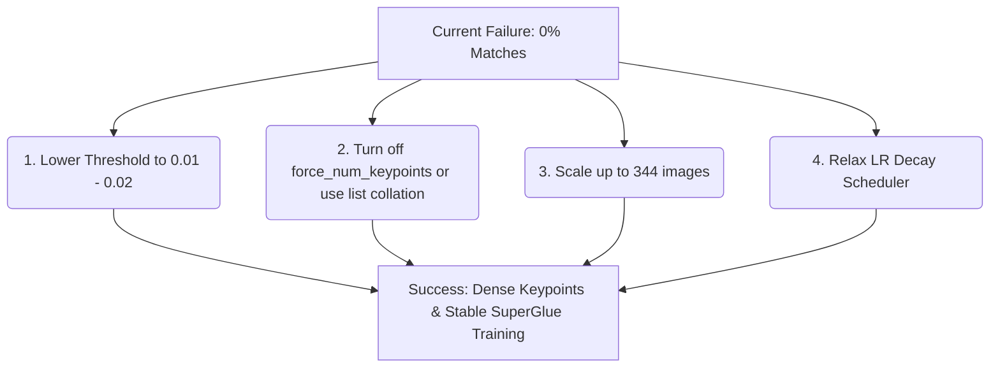

# Analysis of SuperGlue Training on Reflectivity Images

This document provides a detailed analysis of the SuperPoint keypoint score distributions and SuperGlue training performance on your custom dataset of LiDAR reflectivity images. 

---

## 1. Keypoint Confidence & Score Distribution Analysis

We analyzed the confidence scores of the pre-extracted keypoints in your HDF5 dataset files to understand why the matcher is underperforming. Below are the statistics:

### H5 File Metrics Comparison

| Metric | `custom_dataset_custom_SP-k2048-nms4.h5` <br> (Filtered to $\ge 0.02$ / 19 images) | `custom_dataset_custom_SP-k2048-nms4.h5.bak` <br> (Original / 19 images) | `custom_SP-k2048-nms4.h5` <br> (Full Dataset / 344 images) |
| :--- | :--- | :--- | :--- |
| **Total Images** | 19 | 19 | 344 |
| **Avg. Keypoints / Image** | **260.47** | 515.79 | 507.80 |
| **Min / Max Keypoints** | 187 / 322 | 436 / 570 | 478 / 564 |
| **Score Range** | 0.0200 to 0.5664 | 0.0050 to 0.5664 | 0.0050 to 0.6089 |
| **Score Mean / Median** | 0.0849 / 0.0585 | 0.0479 / 0.0203 | 0.0467 / 0.0194 |

### Percentage of Keypoints Exceeding Confidence Thresholds

| Threshold | `custom_dataset_custom_SP-k2048-nms4.h5` | `custom_dataset_custom_SP-k2048-nms4.h5.bak` | `custom_SP-k2048-nms4.h5` | Approx. Avg. Keypoints/Image |
| :--- | :--- | :--- | :--- | :--- |
| **$\ge 0.005$** | 100.00% | 100.00% | 100.00% | ~500 keypoints |
| **$\ge 0.010$** | 100.00% | 72.01% | 70.59% | ~360 keypoints |
| **$\ge 0.020$** | 100.00% | 50.50% | 49.19% | ~250 keypoints |
| **$\ge 0.050$** | 56.25% | 28.41% | 27.08% | ~140 keypoints |
| **$\ge 0.100$** | 28.85% | 14.57% | 14.04% | ~70 keypoints |
| **$\ge 0.200$** | **8.39%** | **4.23%** | **4.12%** | **~21 keypoints** |
| **$\ge 0.300$** | 2.16% | 1.09% | 1.10% | ~5 keypoints |

> [!IMPORTANT]
> Because LiDAR reflectivity images have lower contrast and unique noise characteristics compared to standard optical images, the pre-trained SuperPoint model assigns **low confidence scores** to most keypoints. Only about **4% of the keypoints exceed the $0.2$ threshold**, resulting in only **~21 keypoints per image**.

---

## 2. Root Cause Analysis: Why SuperGlue is Not Performing

During validation, the training logs show `match_precision = 0.00` and `match_recall = 0.00` across all epochs, indicating that SuperGlue is unable to predict any correct matches. Here is why:

### A. Keypoint Sparsity & Noise Flooding (The Padding Trap)
Your training configuration specifies:
```yaml
load_features:
    max_num_keypoints: 512
    force_num_keypoints: True
```
When you filter keypoints with a high threshold like $0.2$, the loader only finds ~21 valid keypoints. To satisfy `force_num_keypoints: True`, the remaining **491 keypoints (96% of the input)** are padded with:
- Completely random coordinate locations
- Zero confidence scores
- Random noise descriptors

As a result, SuperGlue is forced to learn on batches consisting of **96% random noise keypoints**. This prevents the network from learning valid matching relationships.

### B. Extreme Learning Rate Decay
Your learning rate scheduler is configured with:
```yaml
lr_schedule:
    start: 20
    type: exp
    on_epoch: true
    exp_div_10: 10
```
Because this utilizes `MultiplicativeLR`, the learning rate is multiplied by $10^{-0.1} \approx 0.794$ **at every single epoch**. 
- By epoch 100: LR decays from `1e-4` to **`1e-14`**
- By epoch 200: LR decays to **`1e-24`**

The model effectively stops updating and learning after the first 30–40 epochs.

### C. Insufficient Dataset Size
Training SuperGlue from scratch with only **15 training images** and **4 validation images** prevents the attention mechanism from generalizing to new viewpoints. It simply does not have enough structural variation to learn to associate features across perspective warps.

---

## 3. How to Achieve Better Matching Performance

To resolve these issues, we recommend implementing the following adjustments to your dataset and training setup:



### 1. Lower the Feature Loading Threshold
To obtain a healthy density of keypoints for the transformer layers to propagate matches, lower the threshold to **`0.02`** or **`0.01`**. 
- A threshold of `0.02` yields **~250 real keypoints** per image.
- A threshold of `0.01` yields **~360 real keypoints** per image.

### 2. Disable Keypoint Forcing (If Threshold is High)
If you strictly require keypoint confidence to be $\ge 0.2$, disable `force_num_keypoints`. Setting it to `False` will prevent the dataset loader from padding the inputs with 96% noise coordinates.
*Note: This requires setting `collate: False` so batches are loaded as lists of varying lengths.*

### 3. Scale Up the Dataset
Train on the full dataset config (`superpoint_custom+superglue_homography.yaml`) referencing `custom_SP-k2048-nms4.h5` with **344 images**, rather than the 15-image subset.

### 4. Optimize the LR Schedule
Reduce the decay speed so the optimizer has time to converge. Adjust the scheduler config:
```yaml
lr_schedule:
    start: 50
    type: exp
    on_epoch: true
    exp_div_10: 100 # Decays by 10x every 100 epochs instead of 10 epochs
```
