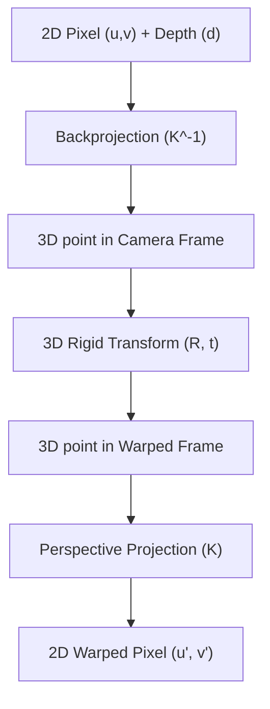

Phase 1: START WITH A BASIC DETECTOR
═════════════════════════════════════

BEFORE Homographic Adaptation:
┌──────────────────────────────┐
│ Use EXISTING detector:       │
│ - SIFT (hand-crafted)        │
│ - ORB (hand-crafted)         │
│ - FAST (hand-crafted)        │
│ - MagicPoint (pretrained)    │
│                              │
│ These detectors find initial │
│ keypoints (even if not great)│
│ Maybe 50-100 keypoints       │
└──────────────────────────────┘
           ↓

Phase 2: HOMOGRAPHIC ADAPTATION LOOP
═════════════════════════════════════

For each training iteration:

1️⃣  Take image I
    ↓
2️⃣  Apply random homography H → get I'
    ↓
3️⃣  Use BASIC DETECTOR on BOTH images:
    ├─ Detect in I → keypoints_I
    └─ Detect in I' → keypoints_I'
    ↓
4️⃣  Match keypoints via homography H:
    ├─ If H(keypoint_I) ≈ keypoint_I'
    │  → THIS IS A GOOD KEYPOINT! ✓
    ├─ If NOT matching
    │  → BAD keypoint, discard ✗
    ↓
5️⃣  Create PSEUDO-LABELS:
    "These matched points are TRUE keypoints"
    ↓
6️⃣  Train SuperPoint on these labels
    ├─ Learn to detect at those locations
    ├─ Learn descriptors for those points
    └─ Improve detection quality
    ↓
7️⃣  Next iteration: Use IMPROVED SuperPoint
    └─ It's now better than basic detector!

THIS IS THE LOOP!

# VISUAL EXPLANATION

ITERATION 1 (Start):
─────────────────────
Basic Detector (ORB):        After Homographic Adaptation:
Finds 60 keypoints    ──→    SuperPoint trained
(maybe 30 are good)          Now finds 100 keypoints
                             (60 good ones!)

ITERATION 2:
─────────────────────
SuperPoint (better):         After next iteration:
Finds 100 keypoints   ──→    SuperPoint trained
(60 are good)                Now finds 150 keypoints
                             (90 good ones!)

ITERATION 3:
─────────────────────
SuperPoint (even better):    After next iteration:
Finds 150 keypoints   ──→    SuperPoint trained
(90 are good)                Now finds 200 keypoints
                             (140 good ones!)

... continue for 30 epochs ...

FINAL (After training):
─────────────────────────
SuperPoint (expert):
Finds 300-400 keypoints!
(250+ are good ones!)

# THE KEY INSIGHT

Q: But don't we need features to find features?

A: YES! But we use BOOTSTRAPPING:

   Start with: BASIC detector (50-100 keypoints)
         ↓
   Train SuperPoint on those
         ↓
   SuperPoint is now BETTER
         ↓
   (Optional) Use SP to generate next labels
         ↓
   Train SuperPoint again
         ↓
   SuperPoint is EVEN BETTER
         ↓
   Repeat...
         ↓
   Final: 300-400 keypoints!

IT'S NOT CIRCULAR - IT'S ITERATIVE IMPROVEMENT!

Basic detector → SuperPoint v1 → SuperPoint v2 → ... → Expert
  (50 KPT)       (100 KPT)       (150 KPT)      (300 KPT)

# WHAT HAPPENS IN YOUR OUTDOOR LIDAR CASE

Your scenario: Outdoor featureless terrain

Step 1: Apply basic detector (ORB or FAST)
        Result: 30-50 keypoints in flat field
        └─ These are mostly NOISE or HORIZON edges
        
Step 2: Create 2 warped versions with homography
        ├─ Image 1: Slightly rotated
        ├─ Image 2: Slightly translated
        └─ Detect in both → get 30-50 points each
        
Step 3: Match through homography
        ├─ Which points appear in BOTH?
        ├─ Answer: Very few! (maybe 15-20)
        └─ These 15-20 are the "TRUE" keypoints
        
Step 4: Train SuperPoint on these 15-20 labels
        └─ Learn: "These specific locations matter"
        
Step 5: Next epoch - now SuperPoint is SLIGHTLY BETTER
        ├─ Finds 40-50 keypoints (instead of 30)
        ├─ More of them repeat across frames
        └─ Can be used as new labels
        
Step 6-30: Repeat
        └─ Gradually improve from 30 → 100 → 200 → 300

# SPECIFIC STRATEGY FOR YOUR OUSTER OS1 + OUTDOOR

Data Collection & Preprocessing
────────────────────────────────────────────
✓ Collect 5000-10000 frames from diverse outdoor scenes:
  ├─ Urban (buildings, streets) → More features
  ├─ Rural (fields, trees) → Some features
  ├─ Open areas (parking lots, plains) → Few features
  └─ Include different weather (dry, wet, etc.)

✓ For each frame, extract 4 channels:
  ├─ Range (depth in meters)
  ├─ Reflectivity (material property)
  ├─ Signal (return strength)
  └─ NearIR (laser reflectance)

✓ Preprocess:
  ├─ Normalize each channel separately
  ├─ Handle invalid points (range=0) → set to 0
  ├─ Resize to (256, 256) if needed (optional)
  └─ Save as .npy files

# Homographic Adaptation Training
─────────────────────────────────────────
The KEY INSIGHT:
  Even in featureless terrain, REPEATABLE patterns exist!
  
  When you warp an image, some regions stay similar:
  ├─ Horizon line positions
  ├─ Ground-object boundaries
  ├─ Texture patterns (even subtle)
  ├─ Depth discontinuities
  └─ Intensity variations

  SuperPoint learns to find these via homographic adaptation!

# THE 3D DEPTH-BASED WARPING ADVANTAGE (LIDAR vs. RGB)
────────────────────────────────────────────────────────────────────────
In traditional computer vision, self-supervised keypoint detection (like standard SuperPoint) uses 2D Homographic Adaptation. This is a severe approximation:
*   **2D Homography Limitation (RGB)**: Assumes the scene is a flat 2D plane (planar surface) or that the camera only undergoes pure rotation (zero translation). When translation occurs in non-flat environments (e.g. outdoors with trees, buildings, and uneven terrain), flat 2D homographies fail at depth boundaries, introducing geometric stretching and matching errors.
*   **LiDAR Projection 3D Warp Advantage**: Since your dataset is generated from an Ouster OS1 LiDAR projected to pinhole camera images, **you have pixel-perfect range (depth) values ($d$) in the `range` channel**. This allows us to perform actual **3D-aware camera projection warping** rather than 2D flat approximations!

### How 3D Warping (3D Homography) Works mathematically:
1.  **Backproject to 3D Space**:
    For every keypoint coordinate $(u, v)$ in the original view, fetch its depth $d = \text{range}(u, v)$ from the range map, and backproject it into 3D camera coordinates using the camera intrinsics $K$:
    $$P_{3D} = d \cdot K^{-1} \begin{bmatrix} u \\ v \\ 1 \end{bmatrix}$$

2.  **Apply 3D Rigid Transform**:
    Apply a realistic 3D camera translation $t$ and rotation $R$:
    $$P'_{3D} = R \cdot P_{3D} + t$$

3.  **Project back to Warped Image**:
    Project the transformed 3D points back onto the warped image plane:
    $$\begin{bmatrix} u' \\ v' \\ 1 \end{bmatrix} \sim K \cdot P'_{3D}$$

### Why this is a Massive Game-Changer for your Outdoor Terrain:
1.  **Parallax Awareness**: Dynamic depth-based warp models real-world parallax perfectly. Features that are occluded or shift differentially relative to their background are accurately warped.
2.  **No Edge-Stretching Artifacts**: 2D homographies create fake artificial stretching at the horizon. 3D warping respects depth discontinuities, so boundaries remain sharp and consistent.
3.  **Synthesizing Realistic Camera Motion**: Instead of arbitrary flat warps, you can simulate actual SLAM trajectory camera steps (e.g., forward translation $+0.5m$, yaw rotation $+5^\circ$) and train SuperPoint descriptors that are exceptionally stable under actual robotic movements.
4.  **Cross-Modality Consensus**: Since the geometry is determined by the `range` channel, this 3D-aware coordinate transformation is identically and perfectly shared across all four modalities (`nearir`, `reflectivity`, `signal`).
