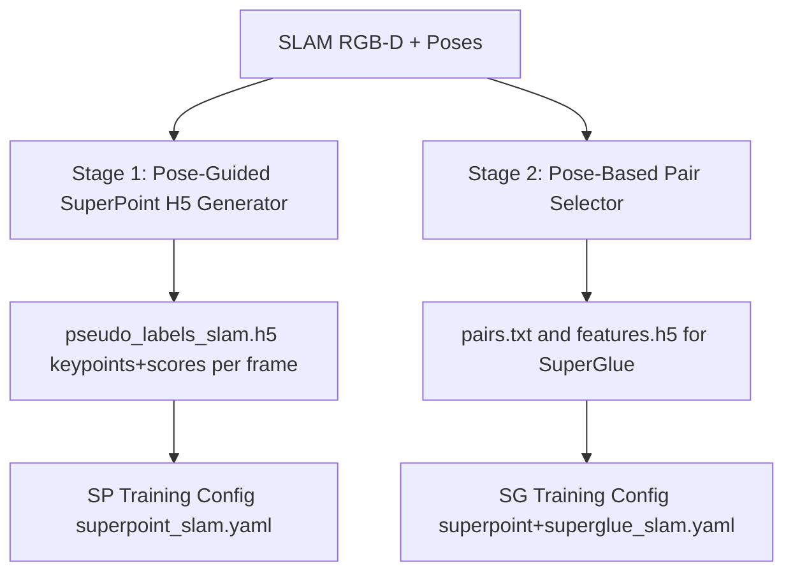

# Pose-Based SLAM Dataset for SuperPoint & SuperGlue Training

## Background

You have a SLAM sequence with **1,682 timestamped RGB-D frames** and matching 6-DOF poses. The goal is to:
1. **Stage 1**: Generate a SuperPoint `.h5` pseudo-label file by running Homographic Adaptation on the RGB images (using poses for smarter pairing)
2. **Stage 2**: Build a SuperGlue-ready `.h5` dataset where **image pairs are selected by pose proximity** (overlapping field of view) using the SLAM poses + depth maps for accurate projective overlap estimation
3. **New YAML configs** for training both SP and SG on this dataset

---

## Data Inventory

| Resource | Details |
|---|---|
| RGB images | `data/output/slam/images/rgb/<timestamp>.png` — 512×207 grayscale (mode L) |
| Depth images | `data/output/slam/images/depth/<timestamp>.png` — 16-bit PNG (depth in mm) |
| Camera calib | `data/output/slam/images/calib/<timestamp>.yaml` — per-frame YAML with K matrix |
| Poses | `data/output/slam/poses_odom_RGBD_slam.txt` — `#timestamp x y z qx qy qz qw` (1,682 lines) |
| K matrix | fx=256, fy=256, cx=256, cy=~103.9, image 512×207 |

---

## Architecture Overview



---

## Open Questions

> [!IMPORTANT]
> **Camera intrinsics**: Each frame has its own calib YAML. For training we'll use a fixed K read from the first frame (K is constant in your data — same sensor setup). Confirm if this is acceptable, or if per-frame K should be used.

> [!IMPORTANT]
> **Pair selection strategy**: For SuperGlue training, pairs are selected based on 3D pose distance (translation + rotation). The default thresholds I'll use are: **max translation distance = 2.0 m**, **max angle = 30°**, **min covisibility overlap = 0.1** (estimated from depth reprojection). Please confirm or adjust these.

> [!NOTE]
> **Dataset split**: With 1,682 frames, I'll use **1,400 for train** and **282 for val** (roughly 83%/17%). Pairs derived proportionally. Confirm if you prefer a different ratio.

---

## Proposed Changes

### Component 1: Stage-1 Pose-Based SuperPoint Pseudo-Label Generator

#### [NEW] `gluefactory/scripts/prepare_slam_superpoint.py`

A new script that:
- Parses `poses_odom_RGBD_slam.txt` (timestamp → SE3 pose via quat→rotation matrix)
- Reads per-frame camera calibration from `calib/<ts>.yaml`
- For each frame, runs **homographic adaptation** (N random warps) on the RGB image using the existing `multimodal_homographic_adaptation` pattern — but single-modality (RGB only) since no LiDAR
- Uses **2D homography warping** (no range channel) → `warp_mode="2d"` by default
- Optionally uses pose-derived relative transforms to generate **pose-consistent synthetic views** instead of pure random homographies
- Writes keypoints + scores per frame into `data/output/slam/exports/pseudo_labels_slam.h5`

**Key differences from `prepare_and_visualize_adaptation.py`**:
- Single `rgb/` modality instead of 4 LiDAR modalities
- Per-frame calibration reading from YAML files
- No `nearir`/`range`/`reflectivity`/`signal` directory structure
- Outputs to `output/slam/` directory namespace

---

### Component 2: Pose-Based Pair Generator (for SuperGlue)

#### [NEW] `gluefactory/scripts/generate_slam_pairs.py`

A standalone preprocessing script that:
1. Loads all poses → builds a KD-tree or pairwise distance matrix (translation + rotation)
2. Filters pairs by:
   - **Translation threshold**: `|t_i - t_j| < max_dist` (e.g., 2.0 m)
   - **Rotation threshold**: `angle(R_i, R_j) < max_angle` (e.g., 30°)
   - **Min distance**: `|t_i - t_j| > min_dist` (e.g., 0.1 m) to avoid near-identical frames
3. Estimates **covisibility overlap** using depth reprojection (project frame i's 3D points into frame j's image) → filters `overlap > threshold`
4. Outputs:
   - `data/output/slam/pairs_train.txt` — `img_i img_j` per line
   - `data/output/slam/pairs_val.txt`
5. Also builds the **SuperGlue H5 feature cache**: extracts SP features with the trained (or pretrained) SP model for each selected frame, saves to `exports/sp_features_slam.h5`

---

### Component 3: New SLAM Dataset Class

#### [MODIFY] `gluefactory/datasets/slam_posed_images.py` [NEW FILE]

A new dataset class `SlamPosedDataset` derived from `PosedImageDataset` that:
- Reads `poses_odom_RGBD_slam.txt` directly (our quaternion format, not the Colmap R|t format)
- Reads camera intrinsics from `calib/<timestamp>.yaml` files (YAML format, not colmap)
- Reads depth as 16-bit PNG in mm → converts to meters (`depth / 1000.0`)
- Provides image pairs via `pairs_train.txt` / `pairs_val.txt` (from Stage 2)
- Outputs standard `view0`, `view1`, `T_w2cam`, `camera`, `depth` tensors compatible with the gluefactory training loop

**Pose parsing**: Convert quaternion `(qx, qy, qz, qw)` → 3×3 rotation matrix, then construct world-to-camera `T_w2cam = Pose.from_Rt(R.T, -R.T @ t)` (invert world pose to camera frame).

**Camera model**: Use `Camera.from_calibration_matrix(K)` with `K` from the YAML calib files.

---

### Component 4: New Training Configs

#### [NEW] `gluefactory/configs/superpoint_slam.yaml`

For SuperPoint training on SLAM RGB data:
```yaml
data:
  name: slam_posed_images   # → new dataset
  root: output/slam
  ...
model:
  extractor:
    name: extractors.superpoint_open
    trainable: True
    ...
```

#### [NEW] `gluefactory/configs/superpoint+superglue_slam.yaml`

For SuperGlue training using pose-based pairs:
```yaml
data:
  name: slam_posed_images
  ...
  view_groups: "{scene}/pairs_{split}.txt"
model:
  extractor:
    name: extractors.superpoint_open
    trainable: False   # freeze SP, train SG only
  ground_truth:
    name: matchers.depth_matcher   # use depth+pose for GT correspondences
  matcher:
    name: matchers.superglue
    ...
```

---

## Detailed File-by-File Plan

### Stage 1: SuperPoint Pseudo-Labels

#### [NEW] `gluefactory/scripts/prepare_slam_superpoint.py`

```
Arguments:
  --data_dir       : path to slam dir (default: output/slam)
  --num_warps      : number of homography warps per image (default: 50)
  --thresh         : keypoint detection threshold (default: 0.015)
  --nms            : NMS radius (default: 4)
  --max_keypoints  : max keypoints per frame (default: 512)
  --weights        : custom SP weights path (optional)
  --num_threads    : parallel workers (default: 4)
  --split_ratio    : train/val split (default: 0.83)

Output:
  output/slam/exports/pseudo_labels_slam.h5
    └── <timestamp>
        ├── keypoints         (N, 2) float32
        └── keypoint_scores   (N,)   float32
  output/slam/image_list_train.txt
  output/slam/image_list_val.txt
```

#### [NEW] `gluefactory/configs/superpoint_slam.yaml`

```yaml
data:
  name: slam_posed_images
  root: output/slam
  scene: slam_scene
  image_dir: images/rgb
  depth_dir: images/depth
  depth_format: png
  pairs_file: pairs_train.txt        # image list for single-view SP training
  preprocessing:
    resize: 512
    side: long
  load_features:
    do: True
    path: output/slam/exports/pseudo_labels_slam.h5
    max_num_keypoints: 512
    force_num_keypoints: True
  train_size: 1400
  val_size: 282
  batch_size: 4
  num_workers: 8

model:
  name: two_view_pipeline
  extractor:
    name: extractors.superpoint_open
    max_num_keypoints: 512
    force_num_keypoints: True
    detection_threshold: -1
    nms_radius: 4
    trainable: True
    lambda_d: 1.0
    dense_outputs: True
  ground_truth:
    name: null
  matcher:
    name: null

train:
  seed: 42
  epochs: 100
  lr: 1e-4
  log_every_iter: 10
  eval_every_iter: 100
  lr_schedule:
    type: exp
    start: 20
    on_epoch: true
    exp_div_10: 10
  plot: [5, 'gluefactory.visualization.visualize_batch.make_keypoint_figures']
```

---

### Stage 2: SuperGlue Pairs + Features

#### [NEW] `gluefactory/scripts/generate_slam_pairs.py`

```
Arguments:
  --data_dir       : path to slam dir (default: output/slam)
  --max_dist       : max translation distance for pairs (m) (default: 2.0)
  --min_dist       : min translation distance (m) (default: 0.1)
  --max_angle      : max rotation angle for pairs (deg) (default: 30.0)
  --min_overlap    : min covisibility overlap fraction (default: 0.1)
  --max_pairs      : max pairs per image (default: 10)
  --split_ratio    : train/val split (default: 0.83)
  --sp_weights     : SP weights to pre-extract features (optional)
  --extract_features : whether to also extract SP features into H5

Output:
  output/slam/pairs_train.txt    → "ts0.png ts1.png" per line
  output/slam/pairs_val.txt
  output/slam/exports/sp_features_slam.h5   (if --extract_features)
    └── <timestamp>.png
        ├── keypoints       (N, 2)
        ├── keypoint_scores (N,)
        └── descriptors     (N, 256)
```

#### [NEW] `gluefactory/datasets/slam_posed_images.py`

Core dataset class with:
- `parse_slam_poses(poses_path)` → dict of `{timestamp: (R_wc 3×3, t_wc 3,)}`
- `load_calib_yaml(calib_path)` → K matrix 3×3
- `SlamPosedDataset(BaseDataset)` — plug-in replacement for `PosedImageDataset`
- Handles single-scene (`slam_scene`) with the poses file as the "views" source
- Returns pairs from `pairs_train.txt`/`pairs_val.txt`

#### [NEW] `gluefactory/configs/superpoint+superglue_slam.yaml`

```yaml
data:
  name: slam_posed_images
  root: output/slam
  scene: slam_scene
  image_dir: images/rgb
  depth_dir: images/depth
  depth_format: png
  pairs_train: pairs_train.txt
  pairs_val: pairs_val.txt
  preprocessing:
    resize: 512
    side: long
  load_features:
    do: True
    path: output/slam/exports/sp_features_slam.h5
    max_num_keypoints: 512
    force_num_keypoints: True
  batch_size: 8
  num_workers: 8

model:
  name: two_view_pipeline
  extractor:
    name: extractors.superpoint_open
    max_num_keypoints: 512
    force_num_keypoints: True
    detection_threshold: -1
    nms_radius: 4
    trainable: False   # frozen SP weights
  ground_truth:
    name: matchers.depth_matcher
    th_positive: 3
    th_negative: 5
    th_epi: 5
  matcher:
    name: matchers.superglue
    descriptor_dim: 256
    weights: indoor
    keypoint_encoder: [32, 64, 128, 256]
    GNN_layers: ['self', 'cross'] * 9
    sinkhorn_iterations: 100
    match_threshold: 0.2

train:
  seed: 42
  epochs: 100
  optimizer: adam
  lr: 1e-4
  log_every_iter: 10
  eval_every_iter: 500
  save_every_iter: 1000
  lr_schedule:
    type: exp
    start: 20
    on_epoch: true
    exp_div_10: 10
  plot:
    - 5
    - gluefactory.visualization.visualize_batch.make_match_figures

benchmarks:
  hpatches:
    eval:
      estimator: opencv
      ransac_th: 0.5
```

---

## Execution Order

```
1. Run prepare_slam_superpoint.py  → produces pseudo_labels_slam.h5 + image lists
2. Run generate_slam_pairs.py      → produces pairs_train.txt + pairs_val.txt (+ optional sp_features.h5)
3. Train SP:  python -m gluefactory.train superpoint_slam
4. Train SG:  python -m gluefactory.train superpoint+superglue_slam
```

---

## Verification Plan

### Automated Tests
- After step 1: verify H5 file has entries for all 1,682 timestamps
- After step 2: check `pairs_train.txt` has > 0 pairs and each pair's pose is within thresholds
- During SP training: monitor `val/keypoint_count` and `val/descriptor_loss`
- During SG training: monitor `val/match_recall` and `val/match_precision`

### Manual Verification
- Visual spot-check: run `python -m gluefactory.datasets.slam_posed_images` to render a few pairs with depth overlays
- Run HPatches benchmark after SP training to validate feature quality vs baseline
- Check that pose-derived `T_0to1` transforms produce correct epipolar geometry on a few pairs

---

## Key Design Decisions

| Decision | Rationale |
|---|---|
| Single-modality (RGB only) | Unlike LiDAR adaptation, SLAM data is pure RGB-D |
| `warp_mode="2d"` for SP pseudo-labels | No LiDAR range channel; 2D homographies sufficient for SP |
| Pose-based pair selection for SG | Ensures training pairs have guaranteed visual overlap, not random |
| Depth matcher for SG ground truth | Provides pixel-accurate correspondence labels using SLAM depth maps |
| Quaternion → rotation matrix | Native SLAM pose format; converts to `Pose.from_Rt()` convention |
| Fixed K from calib YAMLs | K is identical across all frames (same sensor) |
| 16-bit depth PNG → meters | Native depth format; `depth / 1000.0` for metric depth |
