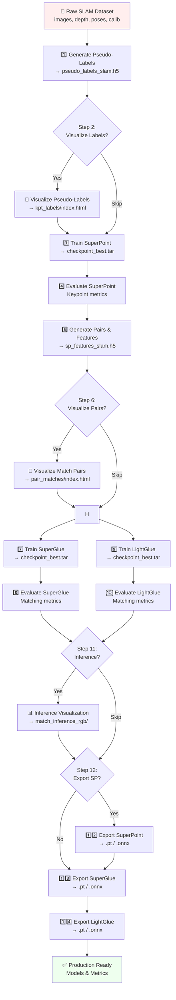

# End-to-End Pose-Aware SLAM Training & Evaluation Pipeline

This guide outlines the workflows for training and evaluating **SuperPoint**, **SuperGlue**, and **LightGlue** on your custom pose-aware SLAM RGB-D dataset (`data/output/slam`). All models can be exported to TorchScript (.pt) and ONNX (.onnx) formats for efficient inference in production.

---

## Pipeline Overview


---

## Dataset Directory Structure & Format

Before running the pipeline, ensure your dataset directory (e.g., `data/output/sample_slam` or `data/output/slam`) is structured as follows:

```text
data/output/sample_slam/
├── poses_odom_RGBD_slam.txt
└── images/
    ├── rgb/
    │   ├── <timestamp>.png
    │   └── ...
    ├── depth/
    │   ├── <timestamp>.png
    │   └── ...
    └── calib/
        ├── <timestamp>.yaml
        └── ...
```

### Format Specifications:
* **RGB Images (`images/rgb/`)**: PNG or JPG format RGB/grayscale frames, named `<timestamp>.<ext>`.
* **Depth Images (`images/depth/`)**: Must be **16-bit PNG format** where values represent depth in millimeters. Depth filenames must **exactly match** their corresponding RGB filename.
* **Camera Calibration (`images/calib/`)**: YAML files named `<timestamp>.yaml` containing a `camera_matrix` (flattened $3 \times 3$ intrinsic matrix $K$). For example:
  ```yaml
  %YAML:1.0
  ---
  camera_name: "1775717079.306867"
  image_width: 512
  image_height: 207
  camera_matrix:
     rows: 3
     cols: 3
     data: [ 256., 0., 256., 0., 256., 103.9, 0., 0., 1. ]
  ```
* **Poses File (`poses_odom_RGBD_slam.txt`)**: A text file located at the root of the dataset directory containing the 6-DOF poses. Each line represents a frame, structured as:
  ```text
  #timestamp x y z qx qy qz qw
  1775717079.306867 1.030000 0.000000 1.860000 -0.500000 0.500002 -0.500000 0.499998
  ```
  The `timestamp` key must match the stem of the image filenames.

---

## 1. SuperPoint Dataset Creation (Pseudo-Labels)

Generate ground-truth keypoint pseudo-labels by applying homographic and 3D projective adaptation to your SLAM frames.

```bash
# --- On Sample Dataset (quick test with 40:60 hybrid adaptation) ---
python3 -m gluefactory.scripts.prepare_slam_superpoint \
    --data_dir data/output/sample_slam \
    --num_warps 50 \
    --pose_ratio 0.6

# --- On Full Dataset (with 40:60 hybrid adaptation) ---
python3 -m gluefactory.scripts.prepare_slam_superpoint \
    --data_dir data/output/slam \
    --num_warps 50 \
    --pose_ratio 0.6
```
*   **Input**: RGB-D frames, camera intrinsics, and pose file (`poses_odom_RGBD_slam.txt`).
*   **Hybrid Adaptation Options**:
    *   `--pose_ratio`: Float (default `0.6`). The fraction of total warps that are relative pose-supervised (`0.6` implies 60% relative pose projection and 40% random 3D/2D homographies).
    *   `--poses_file`: Filename of the SLAM poses text file (default `poses_odom_RGBD_slam.txt`).
    *   `--max_dist` / `--min_dist`: Maximum/minimum camera translation distance in meters (default `2.0` / `0.1`) to search for neighboring frames.
    *   `--max_angle`: Maximum relative camera orientation change in degrees (default `30.0`).
    *   `--min_overlap`: Minimum covisibility field-of-view overlap fraction (default `0.1`).
    *   `--max_neighbors`: Maximum number of co-visible neighboring candidate frames to select from (default `10`).
*   **Output**: `data/output/slam/exports/pseudo_labels_slam.h5` and image lists.

---

## 2. Visualize SuperPoint Dataset (Pseudo-Labels)

Create an interactive HTML dashboard to visualize the generated pseudo-labels overlaid on the RGB frames.

```bash
# --- On Sample Dataset ---
python3 -m gluefactory.scripts.visualize_slam_dataset --source labels \
    --data_dir data/output/sample_slam \
    --max_items 50

# --- On Full Dataset ---
python3 -m gluefactory.scripts.visualize_slam_dataset --source labels \
    --data_dir data/output/slam \
    --max_items 100
```
*   **Outputs**: `data/output/slam/visualizations/kpt_labels/index.html` (viewable in browser).

---

## 3. Train SuperPoint on SLAM Dataset

SuperPoint is trained self-supervised using the `homographies` dataset configuration by warping the RGB SLAM images on-the-fly and matching them to the pre-generated pseudo-labels.

```bash
# --- Train on Full Dataset ---
python3 -m gluefactory.train superpoint_slam_run \
    --conf gluefactory/configs/superpoint_custom_homography_tranning.yaml \
    data.data_dir=output/slam \
    data.image_dir=images/rgb \
    data.image_list=image_list_train.txt \
    data.load_features.path=output/slam/exports/pseudo_labels_slam.h5

# --- Overfit check on Sample Dataset ---
python3 -m gluefactory.train superpoint_sample_run \
    --conf gluefactory/configs/superpoint_custom_homography_tranning.yaml \
    --overfit \
    data.data_dir=output/sample_slam \
    data.image_dir=images/rgb \
    data.image_list=image_list_train.txt \
    data.load_features.path=output/sample_slam/exports/pseudo_labels_slam.h5 \
    data.num_workers=0
```

---

## 4. Evaluate/Validate SuperPoint

Validate your trained SuperPoint model on keypoint repeatability, depth reprojection precision, and pose estimation error using the custom SLAM evaluation pipeline.

```bash
# --- Evaluate on Sample Dataset ---
python3 -m gluefactory.eval.slam \
    --conf superpoint-open+NN \
    data.data_dir=output/sample_slam \
    --overwrite

# --- Evaluate on Full Dataset ---
python3 -m gluefactory.eval.slam \
    --conf superpoint-open+NN \
    data.data_dir=output/slam \
    --overwrite
```

---

## 5. SuperGlue & LightGlue Dataset Creation (Pair Matches)

Generate co-visible image pairs and pre-extract SuperPoint descriptors using your trained model weights. This step is required before training SuperGlue or LightGlue.

```bash
# --- On Sample Dataset ---
python3 -m gluefactory.scripts.generate_slam_pairs \
    --data_dir data/output/sample_slam \
    --extract_features \
    --min_dist 0.0 \
    --sp_weights outputs/training/superpoint_slam_run/checkpoint_best.tar

# --- On Full Dataset ---
python3 -m gluefactory.scripts.generate_slam_pairs \
    --data_dir data/output/slam \
    --extract_features \
    --sp_weights outputs/training/superpoint_slam_run/checkpoint_best.tar
```
*   **Outputs**: `pairs_train.txt`, `pairs_val.txt`, and `exports/sp_features_slam.h5`.

---

## 6. Visualize Match Pairs (Optional)

Visualize the overlapping match pairings side-by-side to verify alignment quality.

```bash
# --- On Sample Dataset ---
python3 -m gluefactory.scripts.visualize_slam_dataset --source pairs \
    --data_dir data/output/sample_slam \
    --max_items 50

# --- On Full Dataset ---
python3 -m gluefactory.scripts.visualize_slam_dataset --source pairs \
    --data_dir data/output/slam \
    --max_items 50
```
*   **Outputs**: `data/output/slam/visualizations/pair_matches/index.html`.

---

## 7. Train SuperGlue on SLAM Pairs

Train the SuperGlue attention-based GNN using the pose-based pairs and the pre-extracted features.

```bash
# --- Train on Full Dataset ---
python3 -m gluefactory.train superglue_slam_run \
    --conf gluefactory/configs/superpoint+superglue_slam.yaml

# --- Overfit check on Sample Dataset ---
python3 -m gluefactory.train superglue_sample_run \
    --conf gluefactory/configs/superpoint+superglue_slam.yaml \
    --overfit \
    data.data_dir=output/sample_slam \
    data.load_features.path=output/sample_slam/exports/sp_features_slam.h5 \
    data.num_workers=0
```

---

## 8. Evaluate/Validate SuperGlue

Evaluate SuperGlue on the custom evaluation pipeline.

```bash
# --- Evaluate on Sample Dataset ---
python3 -m gluefactory.eval.slam \
    --conf gluefactory/configs/superpoint+superglue_slam.yaml \
    data.data_dir=output/sample_slam \
    data.load_features.path=output/sample_slam/exports/sp_features_slam.h5 \
    --overwrite

# --- Evaluate on Full Dataset ---
python3 -m gluefactory.eval.slam \
    --conf gluefactory/configs/superpoint+superglue_slam.yaml \
    data.data_dir=output/slam \
    data.load_features.path=output/slam/exports/sp_features_slam.h5 \
    --overwrite
```
*   **Key Metrics tracked**:
    *   `mreproj_prec@3px`: Mean percentage of inlier keypoints with reprojection error < 3px.
    *   `mgt_match_recall@3px`: Mean match recall compared to depth-based ground truth.
    *   `mrel_pose_error`: Mean relative pose error (rotation and translation combined).

---

## 9. Train LightGlue on SLAM Pairs

Train the LightGlue transformer-based matcher using the same pose-based pairs and pre-extracted SuperPoint features as SuperGlue.

```bash
# --- Train on Full Dataset ---
python3 -m gluefactory.train lightglue_slam_run \
    --conf gluefactory/configs/superpoint+lightglue_slam.yaml

# --- Overfit check on Sample Dataset ---
python3 -m gluefactory.train lightglue_sample_run \
    --conf gluefactory/configs/superpoint+lightglue_slam.yaml \
    --overfit \
    data.data_dir=output/sample_slam \
    data.load_features.path=output/sample_slam/exports/sp_features_slam.h5 \
    data.num_workers=0
```

*   LightGlue offers fewer parameters and faster inference than SuperGlue while maintaining competitive accuracy.
*   Early-stopping and point-pruning (depth/width_confidence) are **disabled** in exported models.

---

## 10. Evaluate/Validate LightGlue

Evaluate LightGlue on the custom evaluation pipeline using the same metrics as SuperGlue.

```bash
# --- Evaluate on Sample Dataset ---
python3 -m gluefactory.eval.slam \
    --conf gluefactory/configs/superpoint+lightglue_slam.yaml \
    data.data_dir=output/sample_slam \
    data.load_features.path=output/sample_slam/exports/sp_features_slam.h5 \
    --overwrite

# --- Evaluate on Full Dataset ---
python3 -m gluefactory.eval.slam \
    --conf gluefactory/configs/superpoint+lightglue_slam.yaml \
    data.data_dir=output/slam \
    data.load_features.path=output/slam/exports/sp_features_slam.h5 \
    --overwrite
```

*   **Key Metrics tracked** (same as SuperGlue):
    *   `mreproj_prec@3px`: Mean percentage of inlier keypoints with reprojection error < 3px.
    *   `mgt_match_recall@3px`: Mean match recall compared to depth-based ground truth.
    *   `mrel_pose_error`: Mean relative pose error (rotation and translation combined).

---

## 11. Inference with SuperGlue & LightGlue (Optional)

Run matching on an entire image directory and generate an interactive HTML dashboard, via the unified `gluefactory.scripts.run_inference` entry point — one script covers checkpoint or exported-model inference for SuperPoint alone, +SuperGlue, or +LightGlue.

```bash
# From the exported .pt models
MPLBACKEND=Agg python3 -m gluefactory.scripts.run_inference \
    --backend exported --matcher superglue \
    --extractor_pt superpoint_slam.pt \
    --matcher_pt   superglue_slam.pt \
    --input data/output/slam/images/rgb \
    --output all --output_dir data/output/slam/visualizations/match_inference_rgb \
    --resize 640 --max_num_keypoints 512

# Or straight from the training checkpoints (no export step needed)
MPLBACKEND=Agg python3 -m gluefactory.scripts.run_inference \
    --backend checkpoint --matcher superglue \
    --extractor_ckpt outputs/training/superpoint_slam_run/checkpoint_best.tar \
    --matcher_ckpt   outputs/training/superglue_slam_run/checkpoint_best.tar \
    --input data/output/slam/images/rgb \
    --output all --output_dir data/output/slam/visualizations/match_inference_rgb \
    --resize 640

# Swap --matcher lightglue (+ the LightGlue checkpoint/.pt) for LightGlue instead.
```

**Output**: Interactive dashboard + visualizations
- `index.html` — interactive match browser with zoom/pan
- `matches_data.js` — match data (keypoints, matches, scores)
- `images/` — pair images
- `plots/` — static PNG match visualizations

---

## 12. Export SuperPoint (Optional)

Export your trained SuperPoint model to TorchScript (.pt) or ONNX for inference in C++ or mobile environments.

**Export to TorchScript (.pt)**:
```bash
python3 -m gluefactory.scripts.export_model \
    --model sp \
    --format pt \
    --ckpt outputs/training/superpoint_slam_run/checkpoint_best.tar \
    --out superpoint_slam.pt \
    --image_h 480 --image_w 640
```

**Export to ONNX (.onnx)**:
```bash
python3 -m gluefactory.scripts.export_model \
    --model sp \
    --format onnx \
    --ckpt outputs/training/superpoint_slam_run/checkpoint_best.tar \
    --out superpoint_slam.onnx \
    --image_h 480 --image_w 640 \
    --opset 16
```

*   **Input**: Image `[B, 1|3, H, W]` float32 in [0, 1]
*   **Output**: `scores` `[B, H, W]` (NMS-filtered heatmap), `descriptors` `[B, 256, H/8, W/8]` (L2-normalised)

---

## 13. Export SuperGlue to TorchScript or ONNX

Export your trained SuperGlue model for efficient inference on CPU or GPU in C++ and web environments.

**Export to TorchScript (.pt)**:
```bash
python3 -m gluefactory.scripts.export_model \
    --model sg \
    --format pt \
    --ckpt outputs/training/superglue_slam_run/checkpoint_best.tar \
    --out superglue_slam.pt \
    --num_kpts 512 \
    --image_h 480 --image_w 640
```

**Export to ONNX (.onnx)**:
```bash
python3 -m gluefactory.scripts.export_model \
    --model sg \
    --format onnx \
    --ckpt outputs/training/superglue_slam_run/checkpoint_best.tar \
    --out superglue_slam.onnx \
    --num_kpts 512 \
    --image_h 480 --image_w 640 \
    --opset 16
```

*   **Input**: `keypoints0`, `keypoints1` `[B, N, 2]` (pixel coords), `descriptors0`, `descriptors1` `[B, 256, N]`, `scores0`, `scores1` `[B, N]` (SuperGlue only), `image0`, `image1` `[B, 1, H, W]` (TorchScript) or `size0`, `size1` `[B, 2]` (ONNX)
*   **Output**: `matches0`, `matches1` `[B, N]` (matched index or -1), `matching_scores0`, `matching_scores1` `[B, N]` (match confidence)

---

## 14. Export LightGlue to TorchScript or ONNX

Export your trained LightGlue model for efficient inference in production environments.

**Export to TorchScript (.pt)**:
```bash
python3 -m gluefactory.scripts.export_model \
    --model lg \
    --format pt \
    --ckpt outputs/training/lightglue_slam_run/checkpoint_best.tar \
    --out lightglue_slam.pt \
    --num_kpts 512 \
    --image_h 480 --image_w 640
```

**Export to ONNX (.onnx)** (requires PyTorch ≥ 2.3 for full compatibility):
```bash
python3 -m gluefactory.scripts.export_model \
    --model lg \
    --format onnx \
    --ckpt outputs/training/lightglue_slam_run/checkpoint_best.tar \
    --out lightglue_slam.onnx \
    --num_kpts 512 \
    --image_h 480 --image_w 640 \
    --opset 16
```

*   **Input**: `keypoints0`, `keypoints1` `[B, N, 2]`, `descriptors0`, `descriptors1` `[B, D, N]`, `image0`, `image1` `[B, 1, H, W]` (TorchScript) or `size0`, `size1` `[B, 2]` (ONNX)
*   **Output**: `matches0`, `matches1` `[B, N]`, `matching_scores0`, `matching_scores1` `[B, N]`
*   **Note**: ONNX export is **incompatible with PyTorch 2.2** due to an exporter bug with rotary attention. Use PyTorch ≥ 2.3 or stick with TorchScript.
